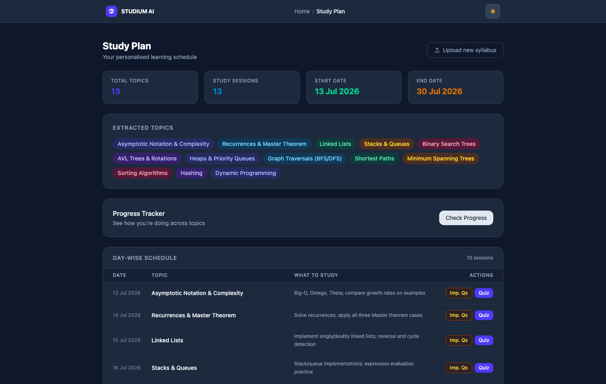
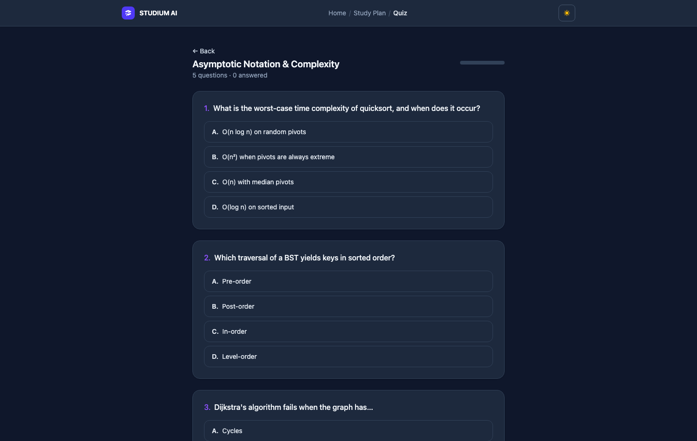
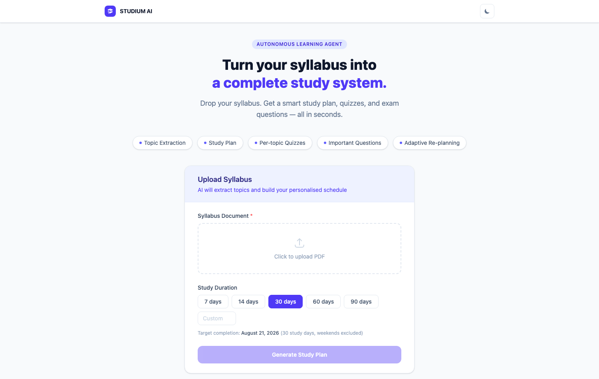

# STUDIUM AI — Adaptive Learning Agent 🎓

> Drop your syllabus. Get a study plan, quizzes, and exam questions — and let the agent re-plan around your weak topics.

[](https://github.com/Gutta09/studium-ai/actions/workflows/ci.yml)
[](LICENSE)



## The agentic loop

The interesting part isn't any single LLM call — it's the closed feedback loop:

```
syllabus PDF ─▶ extract topics ─▶ plan sessions ─▶ student takes quizzes
                                        ▲                    │
                                        │              score per topic
                                        │                    ▼
                                 add review sessions ◀─ detect weak topics (<70%)
```

1. **Planner** extracts topics from the uploaded PDF and breaks them into ordered study sessions
2. **Quizzer** generates per-topic MCQs — answers are stored server-side and *never sent to the client* until submission (no cheating via DevTools)
3. **Results** aggregates scores per topic and flags weak ones (average < 70%)
4. **Re-planner** appends focused review sessions for weak topics — idempotently: a topic that already got review sessions is not re-planned again until re-tested

### Design decision worth knowing about

**The LLM never does calendar math.** The model decides *pedagogy* — topic order, how many sessions a topic deserves, what to study each day. Plain code assigns the business-day dates deterministically (`agents/planner.py: assign_dates`). LLMs are unreliable at date arithmetic; asking one to "skip weekends" is a bug waiting to happen, and the tests prove the code path never lands a session on a Saturday.

Every LLM response is schema-validated before use: malformed quiz questions are dropped, non-JSON output becomes a clean HTTP 502 (not a stack trace), and any date the model hallucinates is discarded.

## Screenshots

| Quiz (dark) | Upload |
|---|---|
|  |  |

## Tech stack

- **Frontend** — React 19 + Vite + TypeScript + Tailwind CSS v4, full dark mode
- **Backend** — FastAPI, agents in `backend/agents/` sharing one LLM gateway (`backend/llm.py`)
- **LLM** — Groq (`llama-3.3-70b-versatile` by default, override with `GROQ_MODEL`) — free tier works
- **Database** — MongoDB (syllabi, plans, quizzes, results)
- **Tests** — 23 pytest cases: date assignment invariants, LLM-output validation, scoring, API contracts (LLM mocked, MongoDB via mongomock)

## Run locally

Prereqs: Python 3.11+, Node 20+, MongoDB running locally (or an Atlas URI).

```bash
# Backend
cd backend
python3 -m venv .venv && source .venv/bin/activate
pip install -r requirements.txt
cp ../.env.example .env         # add your GROQ_API_KEY (free at console.groq.com)
uvicorn main:app --reload       # :8000

# Frontend (separate terminal)
cd frontend
npm install
npm run dev                     # :5173 — proxies /api to the backend
```

```bash
# Tests
cd backend && pip install -r requirements-dev.txt && python -m pytest tests -q
```

## API

| Endpoint | What it does |
|---|---|
| `POST /api/upload-syllabus` | PDF (≤10 MB) + study days → topics + dated study plan |
| `POST /api/quiz/generate` | 5 validated MCQs for a topic (answers withheld) |
| `POST /api/quiz/submit` | Server-side scoring with per-question breakdown |
| `GET /api/results/{syllabus_id}` | Per-topic averages, weak-topic flags |
| `POST /api/replan` | Review sessions for weak topics (idempotent) |
| `POST /api/important-questions` | 2/5/10-mark exam questions with model answers |
| `GET /api/health` | Health probe |

## Honest limitations / roadmap

- **No accounts** — anyone with a syllabus_id can read its plan; auth is the first thing needed for multi-user deployment
- **No URL routing** — view state lives in React state, so refreshing loses your place (react-router migration planned)
- Session `status` (pending/done) exists in the data model but there's no UI to mark sessions done yet
- Topic matching between quizzes and plan sessions is by exact string — a rename by the LLM would orphan results

## License

[MIT](LICENSE)
